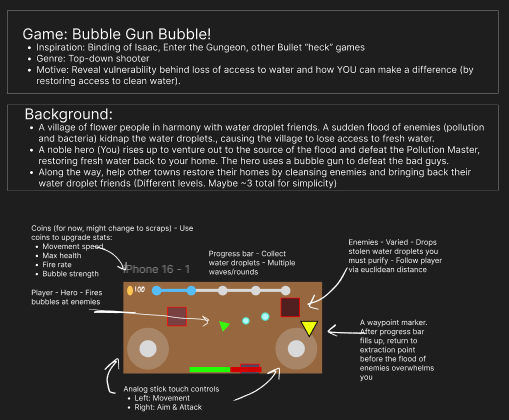
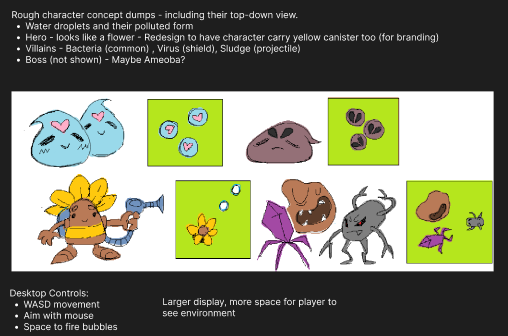

# GCA-Charity-Water-Game
This project was created as a student of the Global Career Accelerator program during studies at UTA. The objective is to develop a game reflective by Charity: water's awareness program.
This project was created as a student of the Global Career Accelerator program during studies at UTA. 
  The objective is to develop a game reflective by Charity: water's awareness program.
  Please do not reproduce or reuse my artistic work.

# Breakdown
* Broken down into two phases: Design and Implementation
* This project progressed about a month
* All sprites are created by me using Krita

# Design
Here are some screenshots of my Figma board to brainstorm the game. Rough sketches are created in MS Paint.

  

# Dev notes and Transparency
* For code projects during my studies at the Global Career Accelerator, I purposely minimize AI generated code in my workflow as a Computer Science student. I believe there is a reasonable expectation to set upon myself doing these projects (GCA is my first exposure to Web Dev projects). This is done to challenge my learning even if use of AI is allowed.
  * At the time I did not record a personal history of how I may have utilized AI, so the breakdown is from the best of my memory in level of certainty.   
* **Github Copilot Usage**: Minimal
  * Debugging (certain)
  * Format tweaks (certain)
* **OpenAI ChatGPT**: Moderate
  * Game mechanics (certain)
